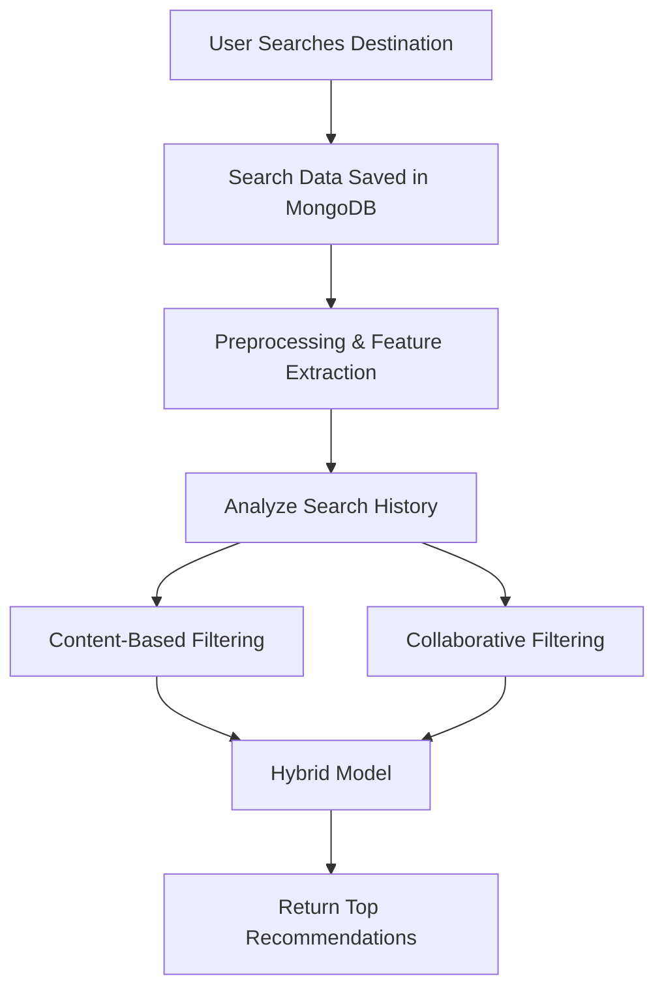

# 🌍 Tours & Travel Recommendation System

> **A Smart AI-Powered Travel Companion**
> Recommends destinations, accommodations, and best times to visit based on user preferences, ratings, and travel history.


---

## 📌 Project Overview

A smart **Tours and Travel Recommendation System** that uses AI to suggest ideal destinations and travel plans. The system tracks user preferences, past search history, and ratings to provide personalized recommendations using a **hybrid recommendation engine** (content-based + collaborative filtering).

---

## 🚀 Features

* 🔍 **Search-Based Destination Suggestions**
* 📈 **AI-Powered Personalized Recommendations**
* 🧠 **Hybrid Recommendation Engine**
* 🗂️ **Category & Feature-Based Filtering**
* 🗓️ **Best Time to Visit Suggestions**
* 📊 **User History Tracking**
* ⚡ Real-time Results with JavaScript/React Integration

---

## 🧭 Recommendation Flow



---

## 📍 Use Case Example

If a user searches for:

* ✅ Goa
* ✅ Mumbai

The system may recommend:

* 🌴 **Kerala**
* 🌊 **Andaman & Nicobar**
* 🌅 **Pondicherry**

---

## 🛠️ Technologies Used

| Area              | Tech Stack                         |
| ----------------- | ---------------------------------- |
| **Backend**       | Python (Flask) / Node.js (Express) |
| **Frontend**      | HTML, CSS, JS / React / Vue        |
| **Database**      | MongoDB / MySQL / Firebase         |
| **ML (Optional)** | Scikit-learn / TensorFlow          |
| **Hosting**       | AWS / Heroku / Firebase Hosting    |

---

## 📋 System Modules

### 1. **User History Tracking**

* Save every user search with:

  * `user_id`
  * `destination`
  * `timestamp`

### 2. **Destination Dataset**

* Fields:

  * `Destination Name`
  * `Category` (Coastal, Hill Station, Historical, etc.)
  * `Popularity Score`
  * `Avg. User Ratings`

### 3. **Recommendation Engine**

* **Content-Based Filtering** using cosine similarity
* **Collaborative Filtering** based on similar user interests
* **Hybrid Approach** combining both for accuracy

### 4. **Real-Time Search Integration**

* Fetch results dynamically using AJAX/Fetch API/React Hooks

---

## ⚙️ How to Run Locally

```bash
# Clone the repository
git clone https://github.com/your-username/Tours-and-Travel-Recommendation-System.git
cd Tours-and-Travel-Recommendation-System

# Set up Python environment
pip install -r requirements.txt

# Run the Flask backend
python app.py

# Open frontend in browser (if using HTML)
# Or run npm start (if using React)
```

---

## 📈 Optimization & Monitoring

* Track user activity and model performance
* Use A/B testing for improvement
* Integrate Google Analytics or custom logging

---

## 🚀 Deployment

* Deploy backend to **Heroku**, **Render**, or **AWS EC2**
* Host MongoDB via **MongoDB Atlas**
* Frontend on **Netlify**, **Vercel**, or **Firebase Hosting**
* Secure APIs using authentication and CORS

---

## 📚 Future Enhancements

* 🧳 Personalized holiday package suggestions
* 🎯 Add sentiment analysis on user reviews
* 🌐 Multi-language support
* 📅 Trip planner with calendar integration

---

## 🤝 Contribution

Contributions are welcome!
Fork the repo → Make your changes → Submit a PR.

---

## 📞 Contact

**Developer:** Kunal Katre
**Email:** `kunalkatre87@gmail.com`
**GitHub:** [@kunalkatre03](https://github.com/yourusername)
